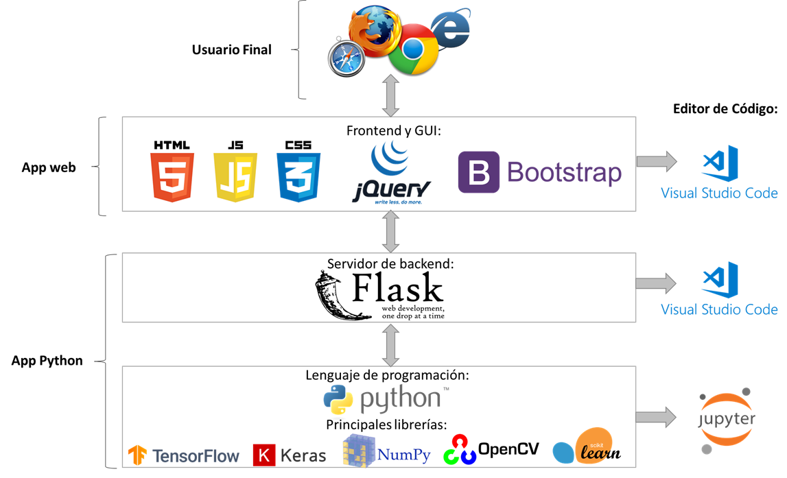

# Tesis Reconocimiento facial Facenet, SVM y Transfer Learning

Aplicacion web desarrollada para mostrar los requerimientos de trabajo de grado para Ingeniero de sistemas titulado "Sistema de Reconocimiento Facial usando Redes Neuronales Convolucionales". 

Se puede evidenciar un resumen de los lenguajes de programación, herramientas y librerías de todo el sistema, incluyendo Modelos de Deep Learning, API REST y Web App. Primero existe la capa de los modelos de Deep Learning los cuales son desarrollados en Python utilizando las principales librerías de ciencias de Datos e Inteligencia Artificial: Tensorflow, Keras, Scikit-learn y Numpy. Además, se le añade la librería de visión Computarizada OpenCV. Seguidamente sigue el servidor backend que funciona como API REST desarrollado en el framework de Python Flask. Por último, se encuentra la capa de Frontend e interfaz gráfica, desarrollada utilizando herramientas de diseño web como lo son HTML, CSS y el lenguaje de programación Javascript, y librerías como Bootstrap y JQuery.  Finalmente, el usuario final podrá acceder a la aplicación desde cualquier navegador web. Ver La Siguiente Imagen



## Fases
Se desarrolló el algoritmo siguiendo las fases descritas por Li y Jain (2011).


## Detección de caras: 
   Para detección de caras actualmente los dos algoritmos más usados son MTCNN ( Multi-task Cascaded Convolutional Networks) y Haar Cascades de la librería OpenCV. El archivo  Haar Cascades se encuentra en este repo llamado haarcascade_frontalface_default.xml. Para descargar los pesos del MTCNN crear una carpeta llamada "npy" y colocar los 3 archivos "det1.npy", "det2.npy", "det3.npy"
   


**modelos preentrenados **
Los modelos preentrenados 
Los modelos de facenet y MTCNN previamente entrenados son proporcionados por el repositorio de David Sandberg, el modelo de facenet previamente entrenado que utilicé se puede descargar aquí (https://drive.google.com/file/d/0B5MzpY9kBtDVZ2RpVDYwWmxoSUk/edit). Se puede ver una lista completa de los modelos de facenet disponibles en ese repositorio [aquí] (https://github.com/davidsandberg/facenet#pre-trained-models). Sin embargo, tenga en cuenta las diferentes especificaciones en cada modelo pre-entrenado.

&nbsp;

**Note**: This is intended as only a **small-scale** facial recognition system, that uses comparison by Euclidean Distance according to an arbitrary threshold (1.1 in this implementation) with one stored image embedding per person. The image files would be needed to be manually uploaded via the web interface or by a mobile app that uploads image files to the address of your server ('localhost:5000/upload' in this implementation) in order to create the embedding files that use the image file's name as the identity.

If you want a scalable solution for hundreds of people or more that would need a classification algorithm instead of Euclidean Distance comparison to each stored embedding file (e.g: K-Nearest Neigbours or Support Vector Machine) on the embedding data with 5-10 examples per person, please refer to the David Sandberg repository [here](https://github.com/davidsandberg/facenet/wiki/Validate-on-lfw#4-align-the-lfw-dataset) on how to align the dataset, and [here](https://github.com/davidsandberg/facenet/wiki/Train-a-classifier-on-own-images) on how to train the classifier (a support vector machine classifier in that implementation).

## Warning
This implementation does not have "liveliness detection" functionality. If you present an image of a person to the web camera it would not know the difference between a real person and a picture.

## References
* Facenet: [paper](https://arxiv.org/abs/1503.03832) - [repository](https://github.com/davidsandberg/facenet)


* Multi-Task Cascading Convolutional Neural Network (MTCNN) for face detection: [paper](https://arxiv.org/abs/1604.02878) - [repository](https://github.com/foreverYoungGitHub/MTCNN)


## Requirements
* Python 3.6

* The pre-trained model I used requires the following:
    * Tensorflow version 1.5
    * [CUDA](https://developer.nvidia.com/cuda-90-download-archive) Toolkit 9.0
    * [cuDNN](https://developer.nvidia.com/cudnn) 7.0


* The rest of the required libraries are listed in the *requirements.txt* file, a virtualenv python environment for this implementation is recommended.    

## Steps
1. Download the pre-trained model [here](https://drive.google.com/file/d/0B5MzpY9kBtDVZ2RpVDYwWmxoSUk/edit).

2. Move the model file to the 'model/' folder, the path of the model should be as follows:

     ```'model/20170512-110547/20170512-110547.pb'```


3. Run the ```server.py``` python file.

4. Navigate to the url of the server (default: localhost:5000).

5. Upload image files of the people via the web GUI interface (**.jpg image files are recommended**). An image should contain one human face, make sure to name the image file as the name of the person inside the image.

    * **Note**: When the image file is uploaded successfully, the cropped face images will appear in the 'uploads/' folder, and the embedding files will appear in the 'embeddings/' folder.


6. With an available web camera, click the 'Click here for live facial recognition with Web Camera!' button in the index web page, press the 'q' keyboard key to shut down the web camera when you are done.
